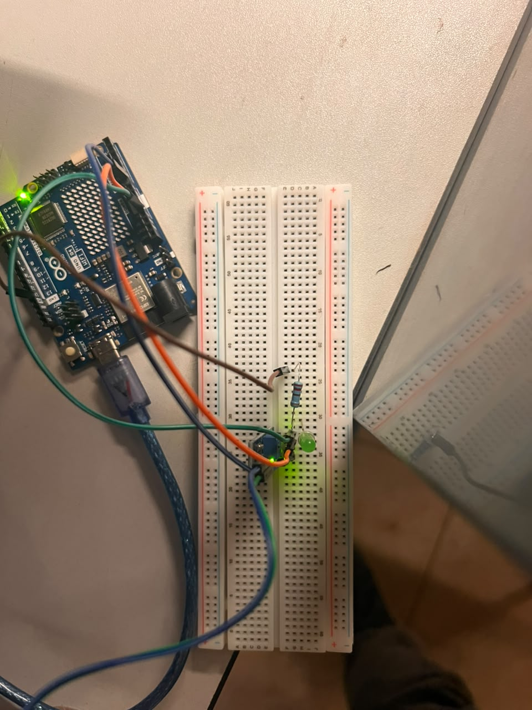

# Biosfera (Litosfera)

## Descripción
Este circuito de arduino utiliza un sensor que detecta cuando la humedad de la tierra baja, si baja, manda una señal para iniciar el riego y además prende un LED para avisar

## Objetivos de aprendizaje
Aprender a utilizar correctamente el sensor de humedad de suelo, circuitos en protoboard y arduino, además de la importancia de mantener un buen nivel de humedad para la conservación de las plantas o cultivos

## Material utilizado
- Sensor de humedad de suelo
- Protoboard
- LED, Jumpers, arduino

## Diagrama del circuito
  

## Código
  📄 [Código del proyecto (Humedad.ino)](codigo/Humedad.ino)

## Video del funcionamiento

## Evidencias de armado

## Conclusiones

Con este proyecto logré armar un sistema de riego automático con Arduino que mide la humedad del suelo y activa el riego y un LED de aviso cuando la tierra está seca. Aprendí a usar el sensor de humedad, a armar circuitos en protoboard y a programar la lógica en Arduino. También comprobé lo importante que es mantener un nivel de humedad adecuado para conservar las plantas y los cultivos, y cómo la tecnología puede ayudar a cuidar el agua evitando el riego en exceso o por falta

## Resultados
